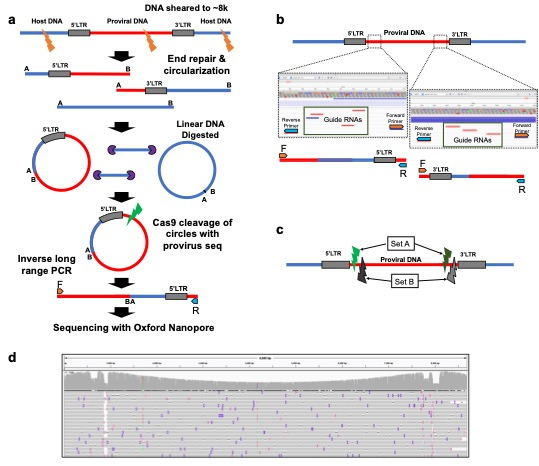

# Pooled CRISPR Inverse PCR sequencing 

Pooled CRISPR Inverse PCR sequencing (PCIP-seq) protocol has been designed to sequence the insertion site and its associated provirus using Oxford Nanopore long-reads technology. The protocol can be found in [PCIP-seq](https://www.biorxiv.org/content/10.1101/558130v2).

<p align="center">
  
</p>

## SUMMARY: Analysis

1. Raw Data Basecalling (.fast5 to .fastq)
2. Mapping to the TARGET-HOST Reference
3. Calling Integration Sites (IS)
4. Calling Integration Sites Specific Variants

The following bioinformatics pipeline is dedicated 

## PREREQUISITES

* albacore (≥ 2.3.1) or guppy
* [porechops (≥ 0.2.4)](https://github.com/rrwick/Porechop) 
* [samtools (≥ 1.9)](http://samtools.sourceforge.net/) 
* [minimap2 (≥ 2.10)](https://github.com/lh3/minimap2) 
* [loFreq (≥ 2.1.2)](http://csb5.github.io/lofreq/) 
* [R ≥3.5.1](https://www.r-project.org/)
  - [Bioconductor (≥ 3.7)](https://www.bioconductor.org/install/) 
  - [ShortRead (≥ 1.3)](https://bioconductor.org/packages/release/bioc/html/ShortRead.html) 
  - [Rsamtools (≥ 1.3.2)](https://bioconductor.org/packages/release/bioc/html/Rsamtools.html) 
  - [cowplot (≥ 0.9.2)](https://cran.r-project.org/web/packages/cowplot/index.html) 
  - [changepoint (≥ 1.32.3)](https://cran.r-project.org/web/packages/changepoint/index.html) 
  - [devtools (≥ 2.0.1)](https://cran.r-project.org/web/packages/devtools/index.html)
  - [dplyr (≥ 0.7.8)](https://cran.r-project.org/web/packages/dplyr/index.html)
  - [ggplot2 (≥ 2.3.1)](https://cran.r-project.org/web/packages/ggplot2/index.html)
  - [magrittr (≥ 1.5)](https://cran.r-project.org/web/packages/magrittr/index.html)
  - [purrr (≥ 0.2.5)](https://cran.r-project.org/web/packages/purrr/index.html)
  - [readr (≥ 1.3.1)](https://cran.r-project.org/web/packages/readr/index.html)
  - [tibble (≥ 2.0.1)](https://cran.r-project.org/web/packages/tibble/index.html)
  - [tidyr (≥ 0.8.2)](https://cran.r-project.org/web/packages/tidyr/index.html)

Code has been run on a Linux fedora 7.2 ('Nitrogen'). 

### Genome:

PCIP-Seq pipeline is based on the detection of chimeric TARGET-HOST reads. A chimeric TARGET-HOST FASTA reference sequence needs to be provided. Genome FASTA sequence can be obtained via [ENSEMBL ftp](https://www.ensembl.org/info/data/ftp/index.html) and combined to the target sequence of your choice. For instance here a chimeric Homo Sapiens - HIV genome is created:

```
GENOME="/path/to/TARGETHOST_INDEX/Homo_sapiens.GRCh37.75.dna.chromosome.fa"
TARGET="/path/to/TARGETHOST_INDEX/HIV_genome.fa"

mkdir TARGETHOST_INDEX
cd TARGETHOST_INDEX

cat $GENOME $TARGET > HSA_GRCh37_75_HIV.fa

TARGETHOST="/path/to/TARGETHOST_INDEX/HSA_GRCh37_75_HIV.fa"
```

### Variables

A serie of variables have to be provided as well:

- RAW - nanopore data generated as described in **Artesi** *et al.* in FAST5 format.
- ANNOTATION - Path to gene annotation in GTF.gz format.
- NAME - Name of the sample
- TARGETNAME - Chromosome ID as in the TARGET FASTA sequence. 
- OUTDIR - Path to the output directory. 
- THREAD - Number of threads.

```
RAW="/path/to/raw.fast5"
ANNOTATION="/path/to/Homo_sapiens.GRCh37.75.gtf.gz"
NAME="HIV_PatientA"
TARGETNAME="HIV"
OUTDIR="/path/to/output/HIV_PatientA"
THREAD=4
```

### Indexing:

Both Minimap2 and LoFreq require indexing of the TARGETHOST FASTA files

```
minimap2 -d /path/to/TARGETHOST_INDEX/HSA_GRCh37_75_HIV.mni $TARGETHOST
samtools faidx $TARGETHOST

TARGETHOSTINDEX="/path/to/TARGETHOST_INDEX/HSA_GRCh37_75_HIV.mni"
```

## Part 1: Basecalling

Basecalling has been performed using albacore.

```
# Albacore
read_fast5_basecaller.py -f FLO-MIN106 -k SQK-LSK108 --recursive --output_format fastq --input $RAW --save_path /path/to/mySample.fastq -t $THREAD

porechop --discard_middle -i /path/to/mySample.fastq -b /path/to/mySample_trimmed.fastq

FASTQ="/path/to/mySample_trimmed.fastq"
```


## Part 2: Mapping to Reference

Detection of new integration sites (IS) requires a [Pairwise mApping Format \(PAF\)](https://github.com/lh3/miniasm/blob/master/PAF.md) alignment as input. 

```
minimap2 -cx map-ont -t $THREAD $TARGETHOSTINDEX $FASTQ > "$NAME"_minimap2_TARGETHOST.paf
```

If you want to visualize the alignment results on [Integrated Genome Viewer \(IGV\)](http://software.broadinstitute.org/software/igv/) minimap2 needs to output a [SAM](https://en.wikipedia.org/wiki/SAM_(file_format)) file as well.

```
minimap2 -ax map-ont -t $THREAD $TARGETHOSTINDEX $FASTQ > "$NAME"_minimap2_TARGETHOST.sam
samtools view -@ $THREAD -Sb "$NAME"_minimap2_TARGETHOST.sam > "$NAME"_minimap2_TARGETHOST.bam
samtools sort -@ $THREAD "$NAME"_minimap2_TARGETHOST.bam -o "$NAME"_minimap2_TARGETHOST.sorted.bam
samtools index -@ $THREAD "$NAME"_minimap2_TARGETHOST.sorted.bam
```

## Part 3: Extracting Integration Sites

A R package has been created to wrap the scripts used in the IS extraction. This package can be installed using [R devtools](https://github.com/r-lib/devtools).

```
devtools::install_github("https://github.com/GIGA-AnimalGenomics-BLV/PCIP-seq")
```

Detection of IS is performed the following R functions. Detailled description of each function can be found using ```?name_of_function```.

```
# 0. Load functions 
library(PCIP)

# 1. Initialize Variables:
PAF.path = "path/to/mySample_minimap2_TARGETHOST.sorted.paf"
targetName = "HTLV"
lengthTarget = 9091
out.prefix = "path/to/mySample"
distanceLTR = 200

# 2. Read PAF file:
PAF <- readPairwiseAlignmentFile(alignFile = PAF.path)

# 3. Filter data:
PAF.filter <- PCIP_filter(minimap2PAF = PAF, targetName = targetName)

# 4. Get Target-Genome breakpoints:
breakpoints <- PCIP_getBreakPoints(PAF = PAF.filter, lengthTarget = lengthTarget, targetName = targetName)

# 5. Group read breakpoints into IS:
breakpoints.summarise <- PCIP_summarise(PCIPbreakpoints = breakpoints, distanceLTR = distanceLTR)

# 6. Save:
write.table(breakpoints.summarise[[1]], paste0(out.prefix, "_", i, "bp-insertionSites.txt"), sep = "\t", row.names = F, quote = F)
write.table(breakpoints.summarise[[2]], paste0(out.prefix, "_", i, "bp-splitFASTQ.txt"), sep = "\t", row.names = F, quote = F)
```


## Part 4: Target-Specific Variant Discovery:

A text file containing newly detected IS of interest is created. 

```
awk -F'\t' 'NR>1 {print $2}' path/to/mySample_200bp-splitFASTQ.txt | sort | uniq > mySample_uniqueIS.txt
```

Target-specific variants are then called. First on the GENOME upstream and downstream of every IS (+/- 20Kb) then on the TARGET itself.

```
while IFS=$'\t' read -r -a line
do
  ## 1. Create an IS specific folder:
  # ID = chr_start_end
  ID=`echo "${line[0]}" | sed 's/\:/_/g' | sed 's/\-/_/g'`
  mkdir $ID
  cd $ID
  
  ## 2. Extract reads belonging to that particular IS and remap them:
  grep -F "${line[0]}" mySample_200bp-splitFASTQ.txt | awk -F'\t' '{print "@"$1}' > "$ID"_readID.fastq
  minimap2 -ax map-ont -t $THREAD $TARGETHOSTINDEX "$ID".fastq > "$ID"_extracted.sam
  samtools view -@ $THREAD -Sb "$ID"_extracted.sam > "$ID"_extracted.bam
  samtools sort -@ $THREAD "$ID"_extracted.bam -o "$ID"_extracted.sorted.bam
  samtools index -@ $THREAD "$ID"_extracted.sorted.bam

  ## 3. Call variants:
  
  ### 3.1. Create a .bed file containing the position to call. A 20Kb window is added upstream and downstream:
  win=20000
  IFS=_ read chr start end <<< $ID
  echo -e $chr'\t'`expr $start - $win`'\t'`expr $end + $win` > GENOME.bed
  echo -e $TARGETNAME'\t'1'\t'$LENGTHTARGET > TARGET.bed

  ## 3.2. Call variant on the HOST GENOME
  loFreq call-parallel --pp-threads $THREAD -f $FASTA_GENOME -l GENOME.bed "$ID"_extracted.sorted.bam > mySample_"$ID"_LoFreq_GENOME.vcf
  
  ## 3.3. Call variant on the TARGET GENOME
  loFreq call-parallel --pp-threads $THREAD -f $FASTA_TARGET -l TARGET.bed "$ID"_extracted.sorted.bam > mySample_"$ID"_LoFreq_TARGET.vcf

done < mySample_uniqueIS.txt

```