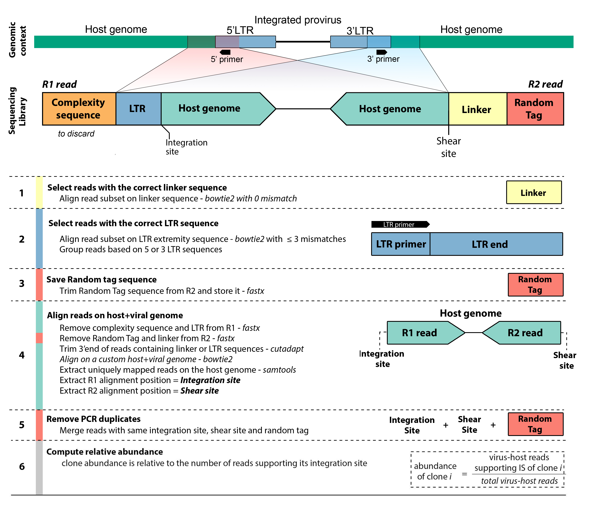

# Proviral Integration Site Calling Pipeline 

## INTRODUCTION

This pipeline is dedicated to the analysis of NGS "clonality" data as described in [Rosewick *et al.*, 2017](https://www.nature.com/articles/ncomms15264), [Artesi *et al.*, 2017](https://www.nature.com/articles/leu2017260) and [Rosewick *et al.*, 2020](https://www.frontiersin.org/journals/microbiology/articles/10.3389/fmicb.2020.587306/full)

Shown below is an example applied to HTLV-1 proviral integration sites.




## PREREQUISITES

* [bbmap](https://archive.jgi.doe.gov/data-and-tools/software-tools/bbtools/bb-tools-user-guide/bbmap-guide/) (≥39.13) -> https://biocontainers.pro/tools/bbmap
* [bowtie2](http://bowtie-bio.sourceforge.net/bowtie2/index.shtml) (≥2.5.4) -> https://biocontainers.pro/tools/bowtie2
* [bowtie](http://bowtie-bio.sourceforge.net/tutorial.shtml) (≥1.3.1) -> https://biocontainers.pro/tools/bowtie
* [cutadapt](https://cutadapt.readthedocs.io/en/stable/installation.html) (≥5.0) -> https://biocontainers.pro/tools/cutadapt
* [fastx](http://hannonlab.cshl.edu/fastx_toolkit/) (≥0.0.13) -> https://biocontainers.pro/tools/fastx_toolkit
* [Picard-Tools](https://broadinstitute.github.io/picard/) (≥1.21) -> https://biocontainers.pro/tools/picard-tools
* [samtools](http://samtools.sourceforge.net/) (≥1.21) -> https://biocontainers.pro/tools/samtools
* [R](https://www.r-project.org/) ≥ 3.2.2
  * PIC (1.3)
  * dplyr (≥0.7.6)
  * ggplot2 (≥2.2.1)
  * tibble (≥1.4.2)
  * readr (≥1.1.1)
  * WriteXLS (≥4.0.0)
  * ShortRead (≥1.3)
  * stringr (≥1.3)
  * tidyr (≥0.8)
  * GenomicRanges (≥1.32.2)
  * Rsamtools (≥1.34.1) 
* Scripts contained in the "tools" folder 
  * filterbyname.sh (from the splice-aware global aligner [BBMap](https://jgi.doe.gov/data-and-tools/bbtools/bb-tools-user-guide/bbmap-guide/))
  * resynchronizePaired.py

PIC package is not available on CRAN. It has to be downloaded from this github (R/PIC_1.3.tar.gz). After installing the prerequisites in R, PIC can be installed as follows from the terminal: 

```
R CMD INSTALL PIC_1.3.tar.gz
```

Specified versions have been tested succesfully. Installation guidelines can be found in INSTALL.
Although the pipeline is relatively light in memory, running it with less than 16 Gb of RAM is not recommended. 

### Indexes

Before mapping, create an index. Three FASTA files have to be provided:

* Retroviral genome
* Host genome
* LTR sequences 
	* LTR sequences 'chromosomes' should be named: ">LTR3" and ">LTR5"
	* Provide only the sequences starting from the primer 'start' until the LTR extremity.

To annotate the final results a GTF file downloaded from ENSEMBL is also required (i.e., [ensembl FTP](ftp://ftp.ensembl.org/pub/release-75/fasta/homo_sapiens/dna/))

#### 1. Create bowtie2 virus-host genome

```
viral_genome="path/to/viral/genome.fasta"
host_genome="path/to/host/genome.fasta"

cat $viral_genome $host_genome > viral_host.fa

bowtie2-build viral_host.fa viral_host 
```

#### 2. Create bowtie2 LTR sequences

```
LTR_sequences="path/to/LTR.fa"

bowtie2-build $LTR_sequences LTR_sequence 
```

#### 3. Prepare the gene annotation file

```
GTF="path/to/ensembl_host.gtf.gz"

zcat $GTF | grep ensembl[[:space:]]gene | awk -F '\t' '{print $9}' | cut -d ';' -f1 | cut -d ' ' -f2 | sed 's/"//g' > geneInfos/geneID.txt
zcat $GTF | grep ensembl[[:space:]]gene | awk -F '\t' '{print $9}' | cut -d ';' -f 3 | awk -F " " '{if($1 == "gene_name"){print $2} else print "NA"}' | sed 's/"//g' > geneInfos/geneName.txt
zcat $GTF | grep ensembl[[:space:]]gene | awk -F '\t' '{print $1"\t"$4"\t"$5"\t"$7}' > geneInfos/genePositions.txt

paste -d '\t' geneInfos/genePositions.txt geneInfos/geneID.txt geneInfos/geneName.txt | sort > geneInfos/geneInfos.sorted.txt
```

#### 4. Define the following variables

```
# HTLV:

LTR5len=36			# Length of the LTR5 sequence, starting from the LTR to the end of the 5'LTR primer
LTR3len=45			# Length of the LTR3 sequence, starting from the 3'LTR primer start to the LTR end
virus="HTLV_ATK"	# Name given to the indexed viral sequence
linkLen=22			# Length of the linker sequence

sampleName="mySample"
r1="path/to/raw/file/r1.fastq"
r2="path/to/raw/file/r2.fastq"
linker="ATGGTGCCAATGGC" # ==> EXAMPLE, should be replaced by the sample's linker

bowtie2_virusHost_index="path/to/bowtie2/virusHost/index/prefix"
bowtie2_LTR_index="path/to/bowtie2/LTR/index/prefix"
geneBedFile="path/to/geneInfos.sorted.txt"

LTR3sequence_firstbp="TTAGTACACA"	# To remove residual sequences
LTR5sequence_firstbp="TGACAATGAC"	
```

## PROCESS THE DATA

### 1. Select reads containing the linker sequence

In order to speed-up detection of linker sequences, short-read aligners are prefered over BLAST/BLAT. We create on-the-fly a new linker index for each sample.

```
mkdir linkerBowtie
cd linkerBowtie

echo ">linker_$linker" >> linker.fa
echo "$linker" >> linker.fa

bowtie-build -q linker.fa linker

cd ..
```

The linker is then extracted from each R2 read according to its hypothetical position (here from position 9 to 9+linkerLen). Sequencing quality is taken into account (-Q33).

```
fastx_trimmer -Q33 -f 9 -l $linkLen -i $r2 -o read_linkers.fastq
```

Sequences are mapped to the linker-index using bowtie. Extract the ID of the reads showing the correct linker sequence.

```
bowtie -l 7 -p 2 -v 0 linkerBowtie/linker read_linkers.fastq | egrep `echo $linker | sed 's/\;/\|/g'` | awk '{print $1}' > readID_linkerFound.txt
```

Filter the R1/R2 reads with the right linker.

```
bbmap/filterbyname.sh in=$r1 in2=$r2 out=R1_linkerFound.fastq out2=R2_linkerFound.fastq names=readID_linkerFound.txt include=t overwrite=t
```

### 2. Select reads with a 5' or 3' LTR sequence

Extract the putative LTR sequence from each read. This sequence is located in R1, right after the complexity sequence (8 bp). 

```
fastx_trimmer -Q33 -f 8 -l $LTR3len -i R1_linkerFound.fastq -o R1_virusLTR3_edge.fastq
fastx_trimmer -Q33 -f 8 -l $LTR5len -i R1_linkerFound.fastq -o R1_virusLTR5_edge.fastq
```

Assign the reads to 5' or 3' LTR by mapping them the the LTR references. Then, select the ID of the reads which map properly to one LTR.

```
bowtie2 -L 14 -p 2 -N 1 -x $bowtie2_LTR_index -U R1_virusLTR3_edge.fastq | grep "LTR3" | awk '{print $1}' | grep -v "^@"  > readID_LTR3Found.txt
bowtie2 -L 14 -p 2 -N 1 -x $bowtie2_LTR_index -U R1_virusLTR5_edge.fastq | grep "LTR5" | awk '{print $1}' | grep -v "^@"  > readID_LTR5Found.txt
```

-L represent the seed substring (minimum 3 and maximum LTR length), -N the number of mismatches in the initial seed alignment (0 or 1), -x the bowtie2 index, -U specifies that data are unpaired.

Intersect the results with R1/R2 to only get reads containing the linker and LTR sequences.

```
bbmap/filterbyname.sh in=R1_linkerFound.fastq in2=R2_linkerFound.fastq out=R1_LTR3Found_linkerFound.fastq out2=R2_LTR3Found_linkerFound.fastq names=readID_LTR3Found.txt include=t overwrite=t
bbmap/filterbyname.sh in=R1_linkerFound.fastq in2=R2_linkerFound.fastq out=R1_LTR5Found_linkerFound.fastq out2=R2_LTR5Found_linkerFound.fastq names=readID_LTR5Found.txt include=t overwrite=t
```

Go from a 0-base to 1-base system:

```
((LTR5len++))
((LTR3len++))
((linkLen++))
```

### 3. Trim the reads

In order to increase the mapping efficiency, only the host genome portion of the read will to be mapped to the host reference genome. LTR, Linker, random tag... have to be trimmed.

First start by removing the linker sequence from R2:

```
fastx_trimmer -Q33 -f $linkLen -i R2_LTR3Found_linkerFound.fastq -o R2_LTR3Found_linkerFound_Host.fastq
fastx_trimmer -Q33 -f $linkLen -i R2_LTR5Found_linkerFound.fastq -o R2_LTR5Found_linkerFound_Host.fastq
```

Then LTR sequences are removed from R1:

```
fastx_trimmer -Q33 -f $LTR3len -i R1_LTR3Found_linkerFound.fastq -o R1_LTR3Found_linkerFound_Host.fastq
fastx_trimmer -Q33 -f $LTR5len -i R1_LTR5Found_linkerFound.fastq -o R1_LTR5Found_linkerFound_Host.fastq
```

Another important source of noise in clonality libraries is the overlap between R1-R2 reads resulting from short insert sizes. This overlap creates soft-clipping in R1 due to the sequencing of R2-linker and in R2 due to sequencing of R1-LTR. To remove them cutadapt is used.

On R1:

```
# Specify LTR sequences to remove
LTR3forward_firstBp=$LTR3sequence_firstbp													# [TTAGTACACA]
LTR3Complement_firstBp=$(echo $LTR3sequence_firstbp | tr "[ATGCatgcNn]" "[TACGtacgNn]")		# [AATCATGTG]
LTR5forward_firstBp=$LTR5sequence_firstbp													# [TGACAATGAC]
LTR5Complement_firstBp=$(echo $LTR5forward_firstBp | tr "[ATGCatgcNn]" "[TACGtacgNn]")		# [GTCATTGTCA]

cutadapt --quiet -n 2 -m 10 -g $LTR3forward_firstBp R1_LTR3Found_linkerFound_Host.fastq | cutadapt --quiet -n 2 -m 10 -g $LTR3Complement_firstBp - > R1_LTR3Found_linkerFound_Host.trimmed.fastq
cutadapt --quiet -n 2 -m 10 -g $LTR5forward_firstBp R1_LTR5Found_linkerFound_Host.fastq | cutadapt --quiet -n 2 -m 10 -g $LTR5Complement_firstBp - > R1_LTR5Found_linkerFound_Host.trimmed.fastq
```

On R2:

```
# Specify LTR sequences to remove
LTR3Complement_firstBp=`$(echo $LTR3sequence_firstbp | tr "[ATGCatgcNn]" "[TACGtacgNn]")`	# [ACACATGATT]
LTR3reverseComplement_firstbp=`$(echo $LTR3Complement_firstBp | rev)`						# [TGTGTACTAA]
LTR5Complement_firstbp=`$(echo $LTR5forward_firstBp | tr "[ATGCatgcNn]" "[TACGtacgNn]")`	# [ACTGTTACTG]
LTR5forward_firstBp=$LTR5sequence_firstbp													# [TGACAATGAC]

cutadapt --quiet -m 10 -a $LTR3Complement_firstBp R2_LTR3Found_linkerFound_Host.fastq | cutadapt --quiet -m 10 -a $LTR3reverseComplement_firstbp - > R2_LTR3Found_linkerFound_Host.trimmed.fastq
cutadapt --quiet -m 10 -a $LTR5Complement_firstbp R2_LTR5Found_linkerFound_Host.fastq | cutadapt --quiet -m 10 -a $LTR5forward_firstBp - > R2_LTR5Found_linkerFound_Host.trimmed.fastq
```

Finally, remaining parts of linker sequences are trimmed:

```
revLinker=$(echo $linker | rev)
revCompLinker=$(echo $revLinker | tr "[ATGCatgcNn]" "[TACGtacgNn]")

cutadapt --quiet -m 10 -a $revLinker R1_LTR3Found_linkerFound_Host.trimmed.fastq | cutadapt -m 10 --quiet -a $revCompLinker - > R1_LTR3Found_linkerFound_Host.trimmed2.fastq
cutadapt --quiet -m 10 -a $revLinker R1_LTR5Found_linkerFound_Host.trimmed.fastq | cutadapt -m 10 --quiet -a $revCompLinker - > R1_LTR5Found_linkerFound_Host.trimmed2.fastq
```

Resynchronise pairs: 

```
python resynchronizePairs.py R1_LTR3Found_linkerFound_Host.trimmed2.fastq R2_LTR3Found_linkerFound_Host.trimmed.fastq
python resynchronizePairs.py R1_LTR5Found_linkerFound_Host.trimmed2.fastq R2_LTR5Found_linkerFound_Host.trimmed.fastq
```

Reassign R1/R2 values to the cleaned FASTQ files:

```
R1_LTR3="R1_LTR3Found_linkerFound_Host.trimmed2.fastq_pairs_R1.fastq"
R2_LTR3="R2_LTR3Found_linkerFound_Host.trimmed.fastq_pairs_R2.fastq"
R1_LTR5="R1_LTR5Found_linkerFound_Host.trimmed2.fastq_pairs_R1.fastq"
R2_LTR5="R2_LTR5Found_linkerFound_Host.trimmed.fastq_pairs_R2.fastq"
```

### 4. Align trimmed reads to host genome

#### 4.1.1. Extract best quality reads (i.e. proper pairs) and separate first/second strands

Align reads to the combined (host + virus reference genome as separated chromosome) reference genome. Allow -N for one mismatch maximum in the initial seed sequence detection. No-mixed option ensures that only reads mapped in pairs will be reported.

```
bowtie2 -p 2 --very-sensitive -N 1 --no-mixed -x $bowtie2_virusHost_index -1 $R1_LTR3 -2 $R2_LTR3 > LTR3_candidateIS_bowtie2_BEST.sam
bowtie2 -p 2 --very-sensitive -N 1 --no-mixed -x $bowtie2_virusHost_index -1 $R1_LTR5 -2 $R2_LTR5 > LTR5_candidateIS_bowtie2_BEST.sam
```

#### 4.1.2. SAM to BAM

```
samtools view -Sb LTR3_candidateIS_bowtie2_BEST.sam > LTR3_candidateIS_bowtie2_BEST.bam
samtools sort LTR3_candidateIS_bowtie2_BEST.bam LTR3_candidateIS_bowtie2_BEST.sorted
samtools index LTR3_candidateIS_bowtie2_BEST.sorted.bam
 
samtools view -Sb LTR5_candidateIS_bowtie2_BEST.sam > LTR5_candidateIS_bowtie2_BEST.bam
samtools sort LTR5_candidateIS_bowtie2_BEST.bam LTR5_candidateIS_bowtie2_BEST.sorted
samtools index LTR5_candidateIS_bowtie2_BEST.sorted.bam
```

#### 4.2.1. Extract alternative positions of each read

Extract the 11 best mapping positions of each read. These alternative positions will be used to detect IS in low-complexity regions (RECALL).

```
bowtie2 -p 2 --very-sensitive -k 11 -N 1 --no-mixed -x $bowtie2_virusHost_index -1 $R1_LTR3 -2 $R2_LTR3 > LTR3_candidateIS_ALTERN_bowtie2.sam
bowtie2 -p 2 --very-sensitive -k 11 -N 1 --no-mixed -x $bowtie2_virusHost_index -1 $R1_LTR5 -2 $R2_LTR5 > LTR5_candidateIS_ALTERN_bowtie2.sam
```

#### 4.2.2. SAM to BAM

```
$samtools view -Sb LTR3_candidateIS_bowtie2_ALTERN.sam > LTR3_candidateIS_bowtie2_ALTERN.bam
$samtools sort LTR3_candidateIS_bowtie2_ALTERN.bam LTR3_candidateIS_bowtie2_ALTERN.sorted
$samtools index LTR3_candidateIS_bowtie2_ALTERN.sorted.bam

$samtools view -Sb LTR5_candidateIS_bowtie2_ALTERN.sam > LTR5_candidateIS_bowtie2_ALTERN.bam
$samtools sort LTR5_candidateIS_bowtie2_ALTERN.bam LTR5_candidateIS_bowtie2_ALTERN.sorted
$samtools index LTR5_candidateIS_bowtie2_ALTERN.sorted.bam
```

### 5. Extract reads mapping to the provirus

For quantification purposes only.

```
samtools view -F 0x40 -q 30 -S LTR3_candidateIS_bowtie2.sam | awk -v vir=$virus '{if($3 == vir){print $0}}' > LTR3_pureViralReads_bowtie2.sam
samtools view -F 0x40 -q 30 -S LTR5_candidateIS_bowtie2.sam | awk -v vir=$virus '{if($3 == vir){print $0}}' > LTR5_pureViralReads_bowtie2.sam
```

### 6. Extract random tag sequence from the R2 raw data

R2 random tags correspond to the 8 first bp of R2 reads

```
fastx_trimmer -Q33 -l 8 -i R2.fastq | fastq_to_fasta -Q33 | fasta_formatter -t | awk '{print $1"\t"$3}' > R2_randomTag.txt
```

### 7. Extract integration sites and compute clone abundance:

```
Rscript run_PIC.R "LTR3_candidateIS_bowtie2_BEST.sorted.bam" "LTR5_candidateIS_bowtie2_BEST.sorted.bam" "LTR3_candidateIS_bowtie2_ALTERN.sorted.bam" "LTR5_candidateIS_bowtie2_ALTERN.sorted.bam" "R2_randomTag.txt" $name $geneBedFile "R1.fastq" $virus 30 25
```

The run_PIC.R script should contain the following arguments:

```
library(PIC)

args <- commandArgs(trailingOnly = TRUE)

PIC(
LTR3.args = args[1],
LTR5.args = args[2],
LTR3.altern = args[3],
LTR5.altern = args[4],
randomTag.args = args[5],
sampleName.args = args[6],
geneBedFile.args = args[7],
rawFASTQ.args = args[8],
virus.args = args[9],
mapqSTRINGENT = args[10],
winMERGE = args[11]
)
```

A brief description of the PIC function is provided at: [PIC](https://github.com/GIGA-AnimalGenomics-BLV/Public/tree/master/PIC/R)
